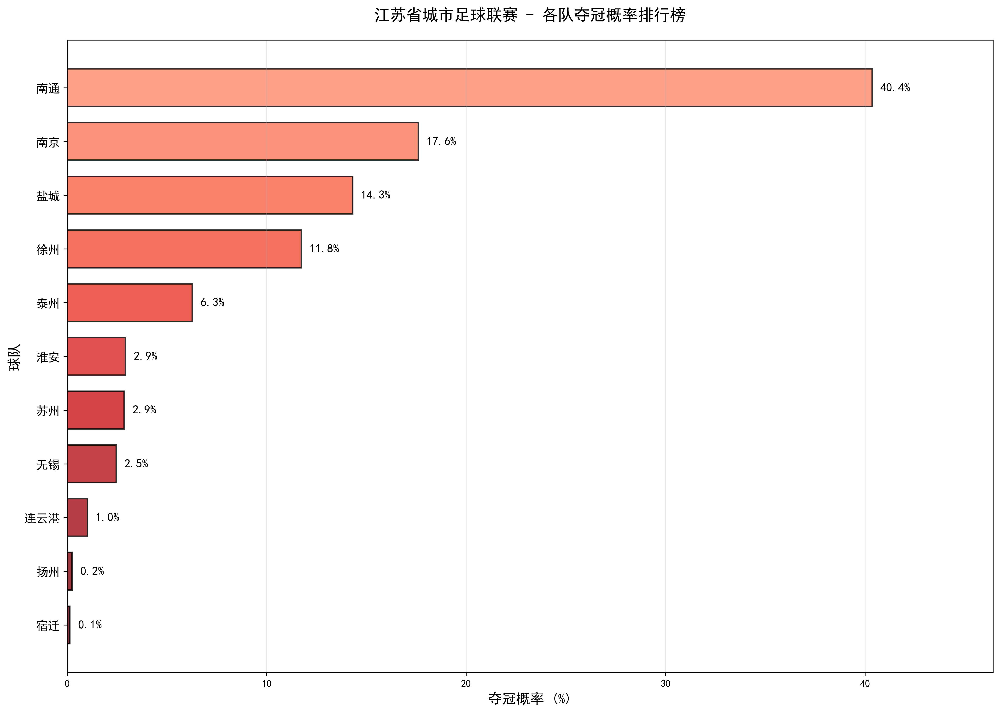
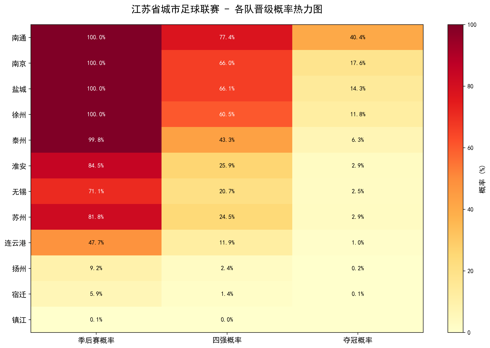
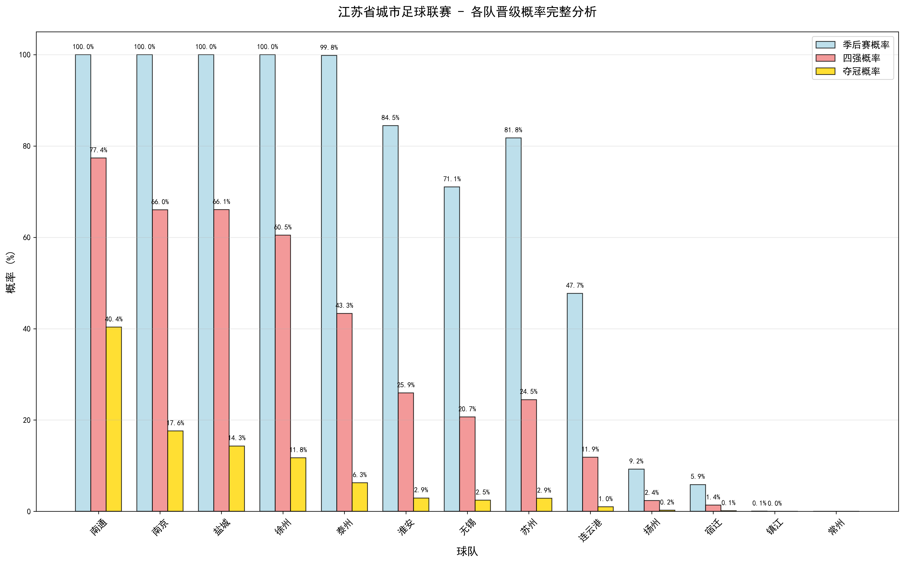
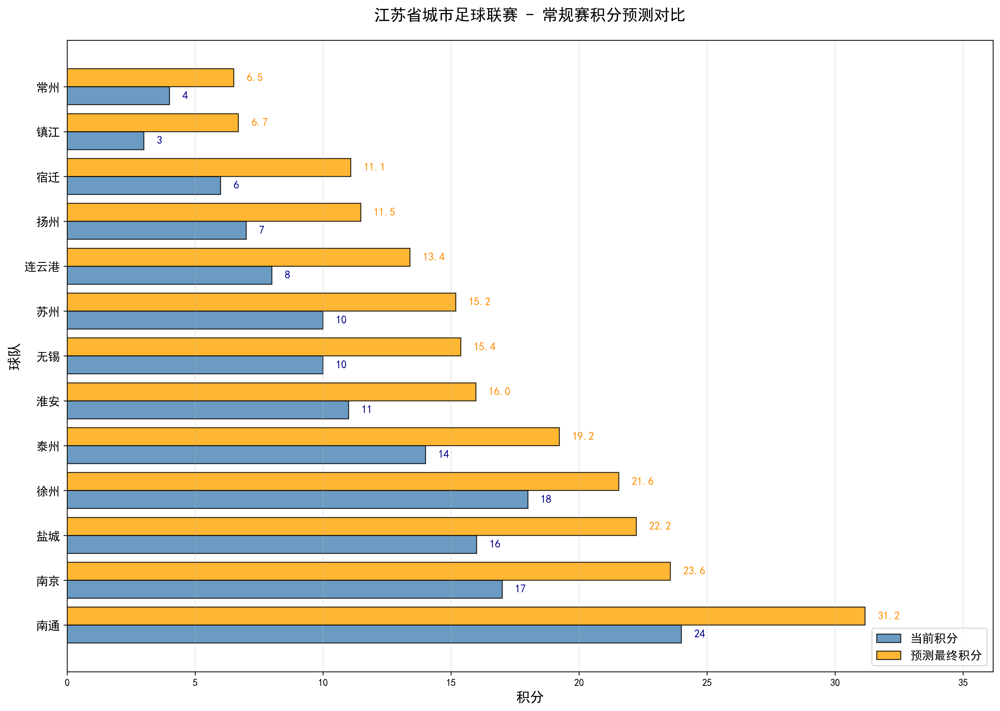
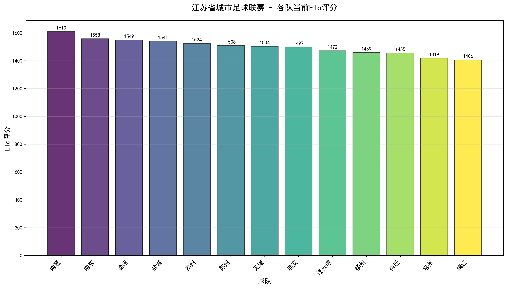

# Jiangsu Provincial City Football League Elo Prediction & Monte Carlo Simulation System

[](https://www.python.org/)
[](https://pandas.pydata.org/)
[](https://matplotlib.org/)
[](https://numpy.org/)

---

##  Project Introduction

This project is a football league prediction tool based on the **Elo rating system** and **Monte Carlo simulation**, specifically designed for the "Jiangsu Provincial City Football League". The system dynamically updates each team's strength rating (Elo Rating) by analyzing historical match data, simulates the remaining regular season and the entire playoffs, and finally provides a detailed analysis of point rankings, promotion probabilities, and championship possibilities.

This project implements a complete data science workflow, from **data preprocessing**, **dynamic Elo model construction**, **large-scale random simulation** to **multi-dimensional result visualization**, aiming to provide a scientific and quantitative prediction reference for the league results.

---

##  Main Features

-   **Dynamic Elo Rating**: Updates each team's Elo rating in real-time based on actual match results (win/draw/loss) and home advantage.
-   **Full-process Monte Carlo Simulation**: Covers all possibilities from the remaining regular season to the playoff final through **10,000** independent simulations.
-   **Dynamic Draw Probability**: The probability of a draw is no longer a fixed value but is dynamically calculated based on the Elo gap between the two teams. The closer the strength, the higher the probability of a draw.
-   **Fine-grained Probability Analysis**: Calculates the precise probabilities for each team to **enter the playoffs**, **advance to the semi-finals**, and **win the championship**.
-   **Rich Data Visualization**: Generates a variety of professional charts (bar charts, heatmaps, etc.) to intuitively display the prediction results.
-   **Automated Data Processing**: Provides an independent script to automatically convert the original Chinese schedule into standardized data for the model.
-   **Result Export and Reproducibility**:
    -   Summarizes all prediction results into a CSV file for further analysis.
    -   Sets a random seed to ensure that the simulation results are **fully reproducible** every time.

---

##  Project Structure

```
Elo/
│
├── data/
│   ├── data.csv                    # Original match data (Chinese headers)
│   ├── processed_train.csv         # (Generated) Preprocessed historical match data
│   ├── processed_test.csv          # (Generated) Preprocessed match data to be predicted
│   └── team_mapping.json           # (Generated) Mapping of team names to IDs
│
├── out/
│   ├── 完整概率分析图.png          # (Generated) Comparison chart of promotion probabilities for all teams
│   ├── 夺冠概率排行榜.png          # (Generated) Bar chart of championship probabilities for each team
│   ├── 积分对比图.png              # (Generated) Comparison chart of current points and predicted final points
│   ├── Elo评分图.png               # (Generated) Ranking of current Elo ratings for each team
│   ├── 概率热力图.png              # (Generated) Heatmap of promotion probabilities
│   └── 江苏省城市足球联赛预测结果.csv  # (Generated) Summary CSV file containing all prediction results
│
├── preprocess.py                   # Data preprocessing script
├── football_league_prediction.py   # Main prediction and simulation script
├── requirements.txt                # Python library dependencies for the project
└── README.md                       # This document
```

---

##  How to Use

### 1. Environment Preparation

First, make sure your system has Python 3.9+ installed. Then clone or download this project and install the required dependencies with the following command:

```bash
pip install -r requirements.txt
```

### 2. Data Preprocessing (Optional)

If you have new raw data `data.csv`, or need to regenerate the processed data, please run the preprocessing script.

```bash
python preprocess.py
```
> **Note**: The project already includes preprocessed data, so this step usually does not need to be repeated. The script will automatically read `data/data.csv` and generate the required files.

### 3. Run the Prediction Model

Execute the main prediction script to start the Elo rating calculation and Monte Carlo simulation.

```bash
python football_league_prediction.py
```

When the script runs, it will output the following information to the console in real-time:
-   Current league standings (based on historical data)
-   A single prediction of the final regular season points
-   Complete probability analysis for all teams (based on simulation)
-   A list sorted by championship probability

### 4. View the Results

All generated charts (`.png`) and CSV files will be saved in the `out/` directory. At the same time, all chart windows will pop up automatically after the program finishes running.

---

##  Model and Method Details

### 1. Data Preprocessing (`preprocess.py`)
-   **Field Standardization**: Replaces the Chinese headers in `data.csv` with English.
-   **Format Conversion**: Converts Chinese dates (e.g., "5月10日") to the standard `YYYY-MM-DD` format.
-   **Data Encoding**: Maps Chinese team names to unique numerical IDs and saves the mapping relationship to `team_mapping.json`.
-   **Label Generation**: Generates match result labels (0: home win, 1: away win, 2: draw) based on the home and away team scores.
-   **Data Splitting**: Automatically splits the data into historical data (`processed_train.csv`) and data to be predicted (`processed_test.csv`) based on whether the match score is empty.

### 2. Elo Rating System
-   **Initial Rating**: The initial Elo rating for all teams is **1500**.
-   **Expected Win Rate ($E_A$)**: For teams A and B, the expected win rate of A is calculated by the formula:
    $E_A = \frac{1}{1 + 10^{(R_B - R_A) / 400}}$
    where $R_A$ and $R_B$ are the Elo ratings of the two teams, respectively.
-   **Home Advantage**: The home team gets a **+100** Elo advantage when calculating the expected win rate.
-   **Rating Update**: After the match, the team's new Elo rating ($R'_A$) is updated according to the following formula:
    $R'_A = R_A + K \times (S_A - E_A)$
    -   $K$ is the K-factor (set to **32** in this project), which represents the weight of the match.
    -   $S_A$ is the actual score (win=1, draw=0.5, loss=0).

### 3. Monte Carlo Simulation
This project uses a full-process simulation to ensure a full exploration of future uncertainties.
1.  **Simulate the remaining regular season**:
    -   In each simulation, iterate through all unplayed regular season matches.
    -   **Dynamic Draw Probability**: Dynamically calculates the draw probability based on the Elo gap between the two sides, the formula is:
        `draw_prob = max(0.1, 0.3 - abs(elo_A - elo_B) / 4000)`
    -   A match result is randomly generated based on the calculated win/draw/loss probabilities.
    -   The points and Elo ratings in that simulation are temporarily updated based on the result.
2.  **Determine playoff qualification**: After the regular season simulation is over, the top 8 teams are determined to enter the playoffs based on the final standings of that simulation.
3.  **Simulate the playoffs**:
    -   Conduct three rounds of single-elimination tournaments (quarter-finals, semi-finals, final).
    -   In the playoffs, the higher-ranked team has home advantage, and there are **no draws**.
4.  **Probability statistics**:
    -   Repeat the above steps **10,000** times.
    -   Count the number of times each team enters the playoffs, semi-finals, and wins the championship in all simulations to calculate the final probability.

---

##  Output File Details

All output files are located in the `out/` directory:

### Core Data Files
-   **`江苏省城市足球联赛预测结果.csv`**
    -   The core output file, containing each team's current points, Elo rating, predicted final points, win/draw/loss record, and various promotion probabilities.

### Visualization Chart Files (`.png`)

#### Championship Probability Rankings
The most intuitive comparison of championship probabilities, showing team strength differences at a glance:



#### Probability Heatmap
A comprehensive display of each team's promotion probabilities at different stages, with darker colors representing higher probabilities:



#### Complete Probability Analysis
Comprehensive comparison of playoff, semi-final, and championship probabilities for all teams:



#### Points Comparison Chart
Comparison of each team's current points with their predicted final points:



#### Elo Rating Chart
A visualized ranking of each team's current Elo strength rating:


 
