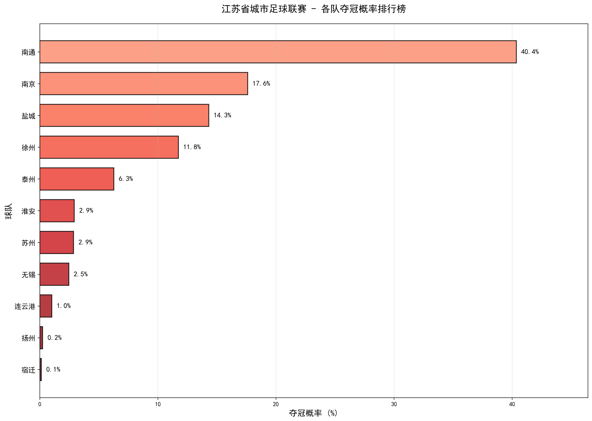
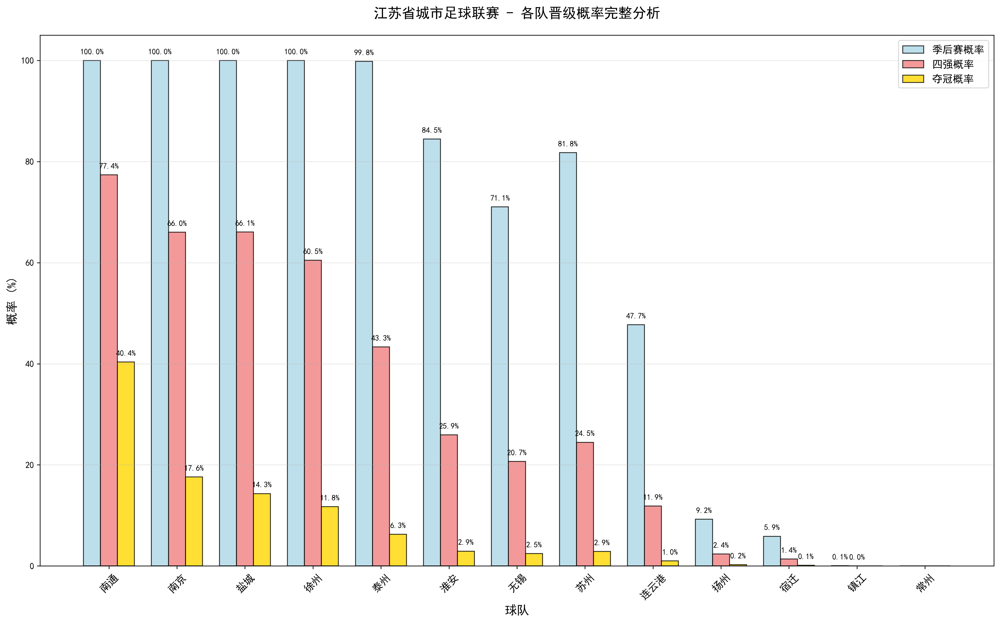

# 江苏省城市足球联赛 Elo 预测与蒙特卡洛模拟系统

[](https://www.python.org/)
[](https://pandas.pydata.org/)
[](https://matplotlib.org/)
[](https://numpy.org/)

---

##  项目简介

本项目是一个基于 **Elo 评分系统** 和 **蒙特卡洛模拟** 的足球联赛预测工具，专为“江苏省城市足球联赛”设计。系统通过分析历史比赛数据动态更新各队实力评分（Elo Rating），并模拟剩余常规赛及整个季后赛，最终提供详尽的积分排名、晋级概率和夺冠可能性分析。

该项目实现了从**数据预处理**、**动态 Elo 模型构建**、**大规模随机模拟**到**多维度结果可视化**的完整数据科学流程，旨在为联赛结果提供一个科学、量化的预测参考。

---

##  主要功能

-   **动态 Elo 评分**：根据真实赛果（胜/平/负）和主场优势，实时更新每支球队的 Elo 评分。
-   **全流程蒙特卡洛模拟**：通过 **10,000 次**独立模拟，覆盖从剩余常规赛到季后赛决赛的所有可能性。
-   **动态平局概率**：平局概率根据对战双方的 Elo 差距动态计算，实力越接近，平局概率越高。
-   **精细化概率分析**：为每支球队计算**进入季后赛**、**晋级四强**和**最终夺冠**的精确概率。
-   **丰富的数据可视化**：生成多种专业图表（条形图、热力图等），直观展示预测结果。
-   **自动化数据处理**：提供独立脚本，将原始中文赛程表自动转换为可供模型使用的标准化数据。
-   **结果导出**：
    -   将所有预测结果汇总到 CSV 文件，便于进一步分析。

---

##  项目结构

```
Elo/
│
├── data/
│   ├── data.csv                    # 原始比赛数据 (中文表头)
│   ├── processed_train.csv         # (已生成) 预处理后的历史比赛数据
│   ├── processed_test.csv          # (已生成) 预处理后的待预测比赛数据
│   └── team_mapping.json           # (已生成) 球队名称到 ID 的映射
│
├── out/
│   ├── 完整概率分析图.png          # (已生成) 所有球队的晋级概率对比图
│   ├── 夺冠概率排行榜.png          # (已生成) 各队夺冠概率的条形图
│   ├── 积分对比图.png              # (已生成) 当前积分与预测最终积分的对比图
│   ├── Elo评分图.png               # (已生成) 各队当前 Elo 评分排行
│   ├── 概率热力图.png              # (已生成) 晋级概率的热力图
│   └── 江苏省城市足球联赛预测结果.csv  # (已生成) 包含所有预测结果的汇总 CSV 文件
│
├── preprocess.py                   # 数据预处理脚本
├── football_league_prediction.py   # 主预测与模拟脚本
├── requirements.txt                # 项目依赖的 Python 库
└── README_CN.md                       # 本文档
```

---

##  如何使用

### 1. 环境准备

首先，确保您的系统已安装 Python 3.9+。然后克隆或下载本项目，并通过以下命令安装所需依赖：

```bash
pip install -r requirements.txt
```

### 2. 数据预处理 (可选)

如果您有新的原始数据 `data.csv`，或者需要重新生成处理后的数据，请运行预处理脚本。

```bash
python preprocess.py
```
> **注意**：项目已包含预处理好的数据，此步骤通常无需重复执行。脚本会自动读取 `data/data.csv` 并生成所需文件。

### 3. 运行预测模型

执行主预测脚本，开始进行 Elo 评分计算和蒙特卡洛模拟。

```bash
python football_league_prediction.py
```

脚本运行时，将在控制台实时输出以下信息：
-   当前联赛积分榜 (基于历史数据)
-   常规赛最终积分的单次预测
-   所有球队的完整概率分析 (基于模拟)
-   按夺冠概率排序的列表

### 4. 查看结果

所有生成的图表 (`.png`) 和 CSV 文件都会保存在 `out/` 目录下。同时，程序运行结束后会自动弹出所有图表窗口。

---

## ⚙ 模型与方法详解

### 1. 数据预处理 (`preprocess.py`)
-   **字段标准化**：将 `data.csv` 中的中文表头替换为英文。
-   **格式转换**：将中文日期（如“5月10日”）转换为标准的 `YYYY-MM-DD` 格式。
-   **数据编码**：将球队中文名映射为唯一的数字 ID，并保存映射关系到 `team_mapping.json`。
-   **标签生成**：根据主客队得分，生成比赛结果标签（0:主胜, 1:客胜, 2:平局）。
-   **数据分割**：根据比赛得分是否为空，自动将数据分割为历史数据 (`processed_train.csv`) 和待预测数据 (`processed_test.csv`)。

### 2. Elo 评分系统
-   **初始评分**：所有球队的初始 Elo 评分为 **1500**。
-   **期望胜率 ($E_A$)**：对于球队 A 和 B，A 的期望胜率计算公式为：
    $E_A = \frac{1}{1 + 10^{(R_B - R_A) / 400}}$
    其中 $R_A$ 和 $R_B$ 分别为两队的 Elo 评分。
-   **主场优势**：主场作战的球队会在计算期望胜率时获得 **+100** 的 Elo 优势。
-   **评分更新**：比赛结束后，球队的新 Elo 评分 ($R'_A$) 根据以下公式更新：
    $R'_A = R_A + K \times (S_A - E_A)$
    -   $K$ 为 K-factor (本项目中设为 **32**)，表示比赛权重。
    -   $S_A$ 为实际得分 (胜=1, 平=0.5, 负=0)。

### 3. 蒙特卡洛模拟
本项目采用全流程模拟，确保对未来的不确定性进行充分探索。
1.  **模拟剩余常规赛**：
    -   在每次模拟中，遍历所有未进行的常规赛。
    -   **动态平局概率**：根据双方 Elo 差距动态计算平局概率，公式为：
        `draw_prob = max(0.1, 0.3 - abs(elo_A - elo_B) / 4000)`
    -   根据计算出的胜/平/负概率，随机生成一个比赛结果。
    -   根据该结果，临时更新该次模拟中的积分和 Elo 评分。
2.  **确定季后赛资格**：常规赛模拟结束后，根据该次模拟的最终积分榜确定前 8 名进入季后赛。
3.  **模拟季后赛**：
    -   进行三轮单败淘汰赛 (8强、半决赛、决赛)。
    -   季后赛中排名高的球队拥有主场优势，且比赛**无平局**。
4.  **概率统计**：
    -   重复以上步骤 **10,000** 次。
    -   统计每支球队在所有模拟中进入季后赛、四强及夺冠的次数，从而计算出最终概率。

---

##  输出文件详解

所有输出文件均位于 `out/` 目录：

### 核心数据文件
-   **`江苏省城市足球联赛预测结果.csv`**
    -   最核心的输出文件，包含每支球队的当前积分、Elo 评分、预测最终积分、胜/平/负场次以及各项晋级概率。

### 可视化图表文件 (`.png`)

#### 夺冠概率排行榜
最直观的夺冠概率对比，一眼就能看出各队实力差距：



#### 概率热力图
以热力图形式展示各队的晋级概率，颜色越深代表概率越高：


#### 完整概率分析图
所有球队的季后赛、四强、夺冠概率全面对比：



#### 积分对比图
对比各队当前积分与预测的最终积分：


#### Elo评分图
各队当前 Elo 实力评分的可视化排行：


 

---

## 贡献

欢迎提交Issue和Pull Request来改进这个项目！

⭐ 如果这个项目对您有帮助，请给它一个星标！感谢您！ 
